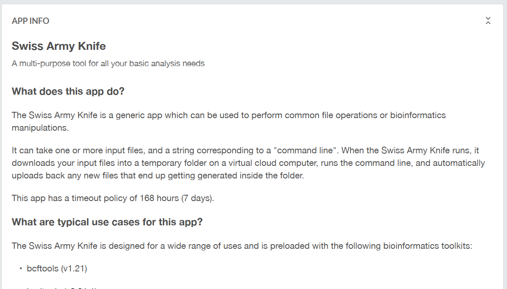
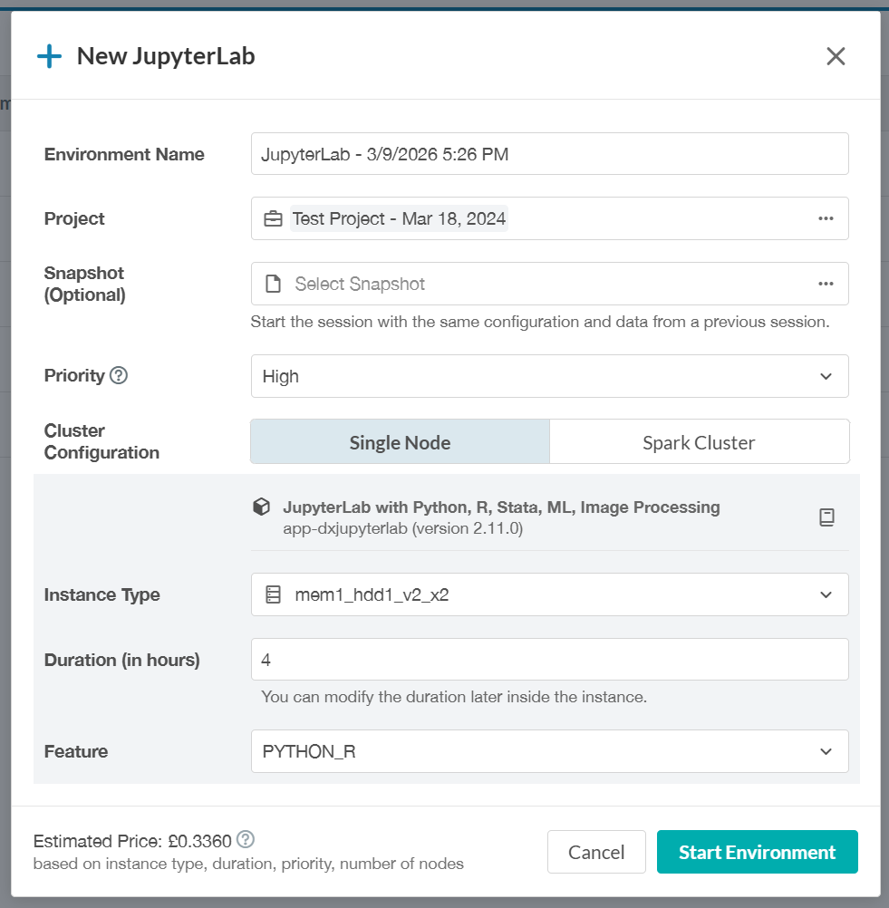
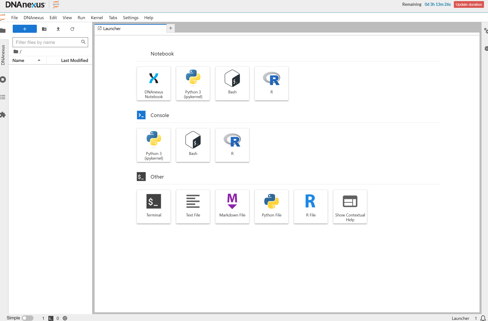
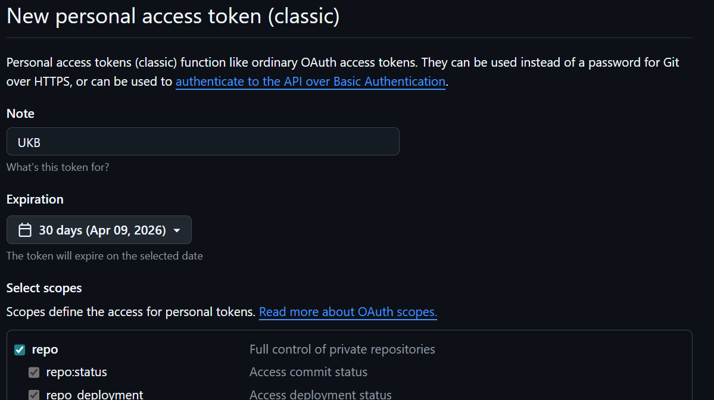

---
config:
  - type: custom
createTime: 2026-03-09
---

# UKB-RAP 速通指南

==*生物信息学篇*==

## 简介

UKB-RAP 是 UKB 的数据研究平台。我们可以通过图形界面纳排构建队列、添加指标、使用 Table Exporter 导出至本地分析，上述流行病学研究方法之前已有探索，在此不详细展开。本文主要讲述使用 UKB 进行生信分析时可能需要用到的工具和方法，包括使用 SAK、JupyterLab、RStudio 进行数据分析，在 JupyterLab 中连接 GitHub 仓库等。在文末，还提供了一些包括 GWAS 在内的官方示例工作流。

## UKB-RAP 上的 SAK、JupyterLab、RStudio

在 TOOLS 栏下拉的选项里，即可进入 SAK、JupyterLab、RStudio。

Swiss Army Knife（SAK）是 UKB 上的一个 APP。正如其名瑞士军刀，可以使用图形化界面运行多种生信工具、执行脚本等。其输入文件可以直接传入也可以通过挂载读取。



JupyterLab 是一个在线数据分析工具。相比于其他图形化的数据操作方式，其自由度更高，可以实现更复杂的工作流，具体将在后文展开。

在 JupyterLab 的启动选项里，值得注意的配置项有：

- `Instance Type`：实例选择，不同的实例有不同的性能和花费。
- `Duration (in hours)`：运行时长，到了设定的时间会自动关闭 Lab。



RStudio 和我们所了解的本地版本基本一致，只不过在浏览器上运行。

关于这些工具的简单介绍和使用，可以参考笔者搬运到 B 站的 [UKB 官方教程]( https://www.bilibili.com/video/BV1jcAYzkE49/)（Part5、Part7）。

@[bilibili p6](BV1jcAYzkE49)

@[bilibili p8](BV1jcAYzkE49)

## 关于 JupyterLab

在启动 JupyterLab 后，我们可以看到包括 Python、R、Bash 在内的多种 Notebook 和终端。



Notebook 是一种交互式代码文档，与普通的脚本式代码相比，其优势在于可以按 cell 分块执行、说明性文字的写入更加方便，更加适合探索、教学、记录。

Python 和 R 我们都比较熟悉，在此不做展开。Bash 是 Linux / macOS 终端中常用的 shell，可以理解为一种命令语言，例如 PLINK 等工具都需要通过 Bash 来运行。

## JupyterLab 上的文件结构与存取

### 主要文件结构与工作目录

进入 JupyterLab 后，默认工作目录为 `/opt/notebooks`，也就是左边第一个文件栏显示的目录。

在终端使用命令 `ls /`，我们可以看到根目录下主要有 `opt`、`mnt`、`home` 等文件夹。

::: file-tree icon="simple"
- bin
  - R
  - unzip
  - ...
- opt
  - **notebooks**
    - work
      - iv.txt
    - B16
      - my_code.ipynb
  - ...
- mnt
  - project
    - .Notebook_archive/
    - Bulk/
    - Showcase_metadata/
    - B16-YZY
      - result.csv
      - pheno.csv
      - ...
    - ...
- home
  - dnanexus/
  - ...
- ... 

:::

`/opt/notebooks` 可以直接作为工作目录使用。

`/mnt` 存储挂载的 UKB 数据，可以直接访问读取，但没有直接写入的权限。`/mnt/project` 下的文件就等同于 UKB-RAP 图形界面里的。例如插补后的基因型数据：`/mnt/project/Bulk/Imputation/UKB imputation from genotype/ukb22828_c1_b0_v3.bgen`。我们可以在左侧点击 `DNAnexus` 查看 UKB 数据结构。

`/home` 在一般语境下是用户的个人目录，但在 UKB 上，由于不能在左侧文件栏显示，所以一般不选择其作为工作目录。

### 读取 UKB 数据

1. 通过挂载访问 `/mnt` 下的文件。

2. 使用 `dx download` 命令。

   ```bash
   dx download B16/pheno.csv
   ```

3. 对于表型数据，除了通过 Table Exporter 导出之外，在 JupyterLab 中我们还可以通过 `dxdata.connect` 直接与 UKB 数据库连接并提取队列数据。详见 [Notebook example [A101]](https://github.com/UK-Biobank/UKB-RAP-Notebooks-Access/blob/main/JupyterNotebook_Python/A101_Explore-phenotype-tables_Python.ipynb)。

### 保存文件

由于 JupyterLab 是一种临时的容器环境，在 session 结束后所有文件都会丢失，所以务必及时保存代码、结果等到别处。除了手动下载外，主要还有以下几种方式：

1. 使用 `dx upload` 命令。

   ```bash
   dx upload B16/results.csv
   ```

2. 上传代码到 GitHub 仓库，详见后文。

3. 对于 JupyterLab 环境，可以被保存为 snapshot，在启动 JupyterLab 时作为输入即可原样复现环境。由于目前接触的工具包都较为轻量，故笔者还未深入研究。

   > If an optional `snapshot` file is provided, the JupyterLab environment will load the Docker environment saved in a previous session. A snapshot tarball file can be created when running the app ("docker commit" and "docker save" commands are used for this purpose). Care should be taken not to create snapshots with very large files, which increases snapshot generation and the future load times. `/home/dnanexus` and `/mnt` folders are excluded from snapshots. DXJupyterLab app version larger than 2.0.0 can't use snaphots created by older app versions older; please use a different version of the app with older snapshots, or re-create the snapshot using this version of the app and use it with this app version.

## Bash 常用命令

| 命令    | 作用           | 示例                     |
| ------- | -------------- | ------------------------ |
| `ls`    | 列出目录内容   | `ls /mnt`                |
| `cd`    | 切换目录       | `cd /opt/notebooks/work` |
| `pwd`   | 显示当前路径   | `pwd`                    |
| `mkdir` | 创建目录       | `mkdir work`             |
| `rm`    | 删除文件或目录 | `rm file.txt`            |
| `rm -r` | 删除目录       | `rm -r folder`           |
| `cp`    | 复制文件       | `cp a.txt b.txt`         |
| `mv`    | 移动 / 重命名  | `mv a.txt new.txt`       |
| `touch` | 创建空文件     | `touch file.txt`         |

## 安装与使用 PLINK

### PLINK2 简介

PLINK2 可以用于分析基因型与表型数据，在 GWAS 等流程中必不可少。

有关 PLINK2 的详细信息，请参阅 [官方文档](https://www.cog-genomics.org/plink/2.0/)。

### 使用 conda 安装 PLINK

使用下面的命令安装 PLINK。

```bash
conda install bioconda::plink2
```

检查是否已经正确安装。

```bash
plink2 --version
```

### PLINK 数据类型

PLINK 使用一组固定文件存储基因型数据。在 UKB 上，全基因组、外显子组等基因数据都是以 PLINK 文件存储的。

- **一般基因型数据**

  `.bed`、`.bim`、`.fam` 是 PLINK1 格式，`.pgen`、`.pvar`、`.psam` 是 PLINK2 格式。执行 PLINK 操作时，往往需要配套的三个文件一起读取。UKB 上的插补前基因型数据为 `.bed`、`.bim`、`.fam` 格式。

  - `.bed`/`.pgen`：基因型数据（二进制）
  - `.bim`/`.pvar`：SNP 信息
  - `.fam`/`.psam`：样本信息

- **BGEN 格式**

  BGEN 格式主要用于插补后产生的基因型概率数据。在读取时 `.bgen` 和 `.sample` 必须的，`.bgi` 用于加速读取。UKB 上的插补后数据使用这类格式存储。

  - `.bgen`：基因型概率（二进制）
  - `.bgi`：SNP 索引
  - `.sample`：样本信息

### 基本命令结构

```bash
plink2 \
  --bfile data \ # 输入数据
  --freq \ # 可自由添加的参数，用于分析、筛选等，例如这里使用  --freq 计算等位基因频率
  --out result # 输出文件
```

可用的参数详见 [PLINK 2.0 index](https://www.cog-genomics.org/plink/2.0/index)。

## 连接 GitHub

### 关于 GitHub

GitHub 是一种基于云的平台，可在其中存储、共享并与他人一起编写代码。

> GitHub 流程是一个基于分支的轻量级工作流程。 GitHub 流程对每个人都有用，而不仅仅是开发者。

通过 GitHub，我们可以方便地获取他人的开源代码，并上传自己的代码到 GitHub 仓库，实现优雅的版本控制。

如果有余力，笔者认为可以花 2~3 小时学习一些 GitHub 的入门知识。

想要了解有关 GitHub 的更多信息，请参阅 [GitHub 入门文档](https://docs.github.com/zh/get-started)。

### 注册个人帐户

如果你是第一次接触 GitHub，首先需要注册一个免费个人帐户。

在浏览器中访问 [Github](https://github.com) 并点击右上角的 “[Sign Up](https://github.com/signup)” 来注册。具体步骤可以参考 [在 GitHub 上创建帐户](https://docs.github.com/zh/get-started/start-your-journey/creating-an-account-on-github) 。

### 第一个仓库

如果想要保存自己的代码、上传项目到 GitHub，那么这一步是必须的。

登陆后，在网站右上角点击加号并选择 [创建新的仓库](https://github.com/new)，详见 [Step 1: Create a new repository for your project](https://docs.github.com/zh/get-started/start-your-journey/uploading-a-project-to-github#step-1-create-a-new-repository-for-your-project)。

在我们的应用场景下，大部分时候我们应该在 “Choose visibility/选择可见性” 处改为 “Private/私人”。这样只有本人可以访问该仓库。

### 生成 Token

想要在工作环境中访问 GitHub，我们需要配置一定的凭证信息，让 GitHub 确认是你本人在操作，这种方式代替了输入密码。

```
工作环境，如UKB平台  --(SSH/HTTPS认证)-->  GitHub
```

使用 HTTPS 连接要求提供 Token，所以我们需要先生成 Token。

在设置界面 [创建新令牌](https://github.com/settings/tokens/new)，按提示填写信息并在下面 “Select scopes/选择范围” 处勾选第一个大类 repo。



生成 Token 之后务必自行保存，它只会显示一次。

### 在 JupyterLab 环境中接入 GitHub

由于 JupyterLab 是临时的容器环境，每次启动我们都需要完成下面的两步配置。

1. 启用缓存凭证

   ```bash
   git config --global credential.helper store
   ```

5. 为 commit 设置 name 和 email。

   ```bash
   git config --global user.name "your_name"
   git config --global user.email "your_email@example.com"
   ```

配置完成后，除了第一次发送请求需要输入用户名和 Token 之外，在本次 session 中都不需要重复输入了。

使用 git 命令，我们可以远程操作 GitHub 仓库。详见 [使用 Git](https://docs.github.com/zh/get-started/using-git)。

- 克隆仓库。

  ```bash
  git clone https://github.com/USERNAME/REPOSITORY.git
  ```

- 保存文件到 GitHub 仓库。

  ```bash
  git add demo.ipynb
  git commit -am "description"
  git push
  ```

### GitHub 资源

UKB 团队在 GitHub 上有许多可供参考学习的示例代码。

- ==**UKB_RAP**==

  <RepoCard repo="dnanexus/UKB_RAP" />
  
  包括
  
  | 子项目                                                       | 参考视频                                                     | 文档                                                         |
  | ------------------------------------------------------------ | ------------------------------------------------------------ | ------------------------------------------------------------ |
  | [GWAS](https://github.com/dnanexus/UKB_RAP/tree/main/GWAS)   | [【UKB-GWAS】GWAS on the Research Analysis Platform using regenie](https://www.bilibili.com/video/BV1gQNFzjEjk/) | -                                                            |
  | [end_to_end_gwas_phewas](https://github.com/dnanexus/UKB_RAP/tree/main/end_to_end_gwas_phewas) | [【UKB GWAS】End to End Target Discovery with GWAS and PheWAS on the UK Biobank Res](https://www.bilibili.com/video/BV11wNczBEF9/) | [End-to-end target discovery with GWAS and PheWAS](https://dnanexus.gitbook.io/uk-biobank-rap/science-corner/end-to-end-target-discovery-with-gwas-and-phewas) |
  
- ==**UKB-RAP-Notebooks-Access**==

  <RepoCard repo="UK-Biobank/UKB-RAP-Notebooks-Access" />

  主要讲述如何获取 UKB 上的表型数据。
  
- ==**UKB-RAP-Notebooks-Genomics**==

  <RepoCard repo="UK-Biobank/UKB-RAP-Notebooks-Genomics" />

  主要讲述如何在 UKB-RAP 上进行遗传学研究，包括 GWAS、PCA、PRS 计算、变体标注等流程。

## 其他链接

- [UKB-RAP 官方文档](https://dnanexus.gitbook.io/uk-biobank-rap)

  可以特别关注 [Science Corner](https://dnanexus.gitbook.io/uk-biobank-rap/science-corner/about-the-science-corner) 部分，有许多实例。

- [UKB 社区](https://community.ukbiobank.ac.uk/hc/en-gb/community/topics)

